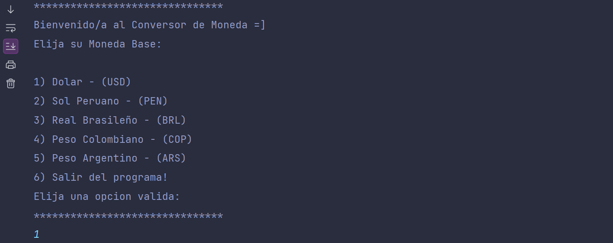
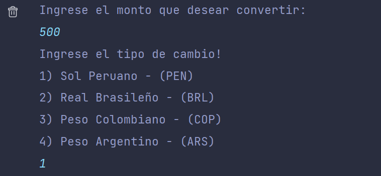
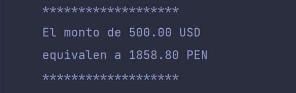
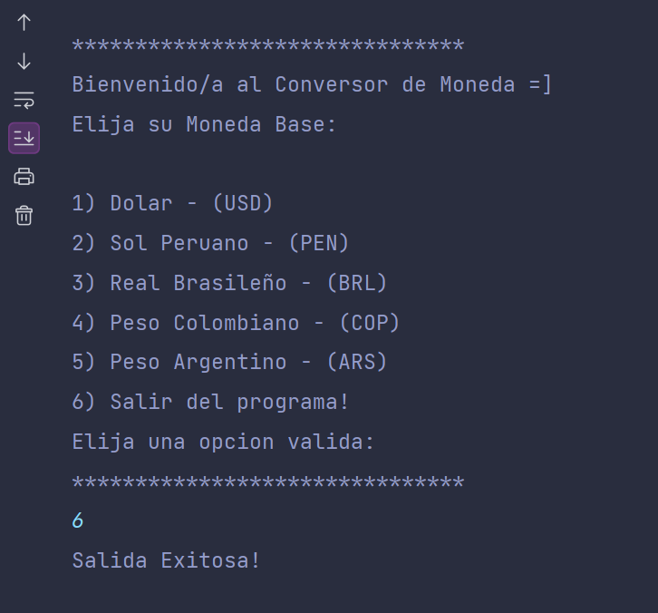

 

<h1 align="center">Currency Converter App</h1>

## Indice

- 🚀 [Título e imagen de portada](#Título-e-imagen-de-portada)

- 📋 [Índice](#índice)

- 🔎 [Descripción del proyecto](#decripcion-del-proyecto)

- 📚 [Características de la aplicación y demostración](#Características-de-la-aplicación-y-demostración)

- 🛠️ [Tecnologías utilizadas](#tecnologías-utilizadas)

- 💪 [Desarrollador](#personas-desarrolladores)

- ⚡️ [Conclusión](#conclusión)

## 1. Descripcion del Proyecto

La Aplicacion "Currency Converter", es una aplicacion desarrollada en Java que funciona en su totalidad a travez de la consola.
El objetivo de la aplicacion es brindar un tipo de cambio de divisas previamente seleccionada por el usuario, para ello
la aplicacion hace uso de una API externa llamada "ExchangeRateApi".

## 2. Caracteristicas de la aplicacion y demostracion

- Se muestra la bienvenida al usuario y un menu principal donde podra elegir su moneda base,
  recordar que el usuario solo puede elegir una de las 6 opciones, ademas se debe asegurarce de 
  ingresar solo numeros a la consola.

- Luego de la eleccion de su moneda base, se le pedira al usuario introducir el monto de dinero 
  a cambiar, recordar que este monto esta al tipo de moneda previmente seleccionada.
- Despues de introducir el monto, le aparecera un segundo menu donde podra elegir el tipo de cambio
  que desea realizar.

- Por ultimo el usuario obtendra el monto en su moneda base, y el monto en su tipo de cambio.

- Mientra el usuario no especifique que desea salir del programa este seguira en ejecucion,
  para terminar su ejecucion solo debe seleccionar la opcion 6 como se muestra a continuacion:

## 3. Tecnologias usadas

- 🏴󠁩󠁤󠁪󠁷󠁿 Java 8
- 🔨 Gson (libreria externa para el mapeo de objetos)

## 4. Desarrollador

**Ibrahim Almeyda R**.

## 5. Conclusiones

Para el desarrollo de esta aplicacion fue necesaria una buena base en java, desde el dominio de POO,
estructuras de datos y consumo de APIs. La aplicacion funciona y puede manejar excepciones pero aun
hay muchos puntos sobre los que mejorar.
